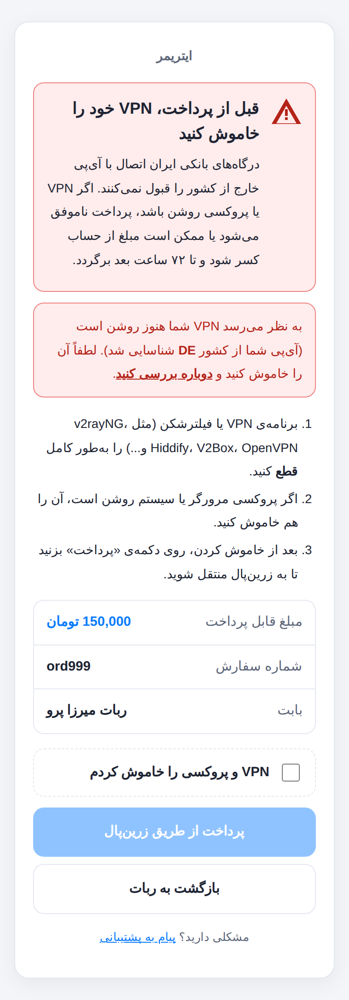

<div dir="rtl">

# درگاه واسط زرین‌پال برای ربات میرزا پرو

به جای اینکه کاربر از ربات مستقیم به زرین‌پال برود، اول وارد صفحه‌ی شما روی سرور **ایتریمر** می‌شود.
آنجا به او هشدار داده می‌شود که VPN را خاموش کند و بعد با زدن دکمه‌ی پرداخت به زرین‌پال منتقل می‌شود.



## مسیر پرداخت

```
ربات میرزا ──(لینک پرداخت)──► start.php (روی سرور ربات)
                                   │  سفارش و مبلغ را در دیتابیس ربات چک می‌کند
                                   ▼  لینک امضاشده (HMAC)
        سرور ایتریمر:  index.php  ── صفحه‌ی هشدار «VPN را خاموش کنید»
                                   │  کاربر تیک می‌زند و «پرداخت» را می‌زند
                                   ▼
                       pay.php  ── درخواست پرداخت به زرین‌پال ──► صفحه‌ی پرداخت زرین‌پال
                                                                        │
                       callback.php ◄───────────────────────────────────┘
                                   │  verify در زرین‌پال
                                   ▼  POST امضاشده
        سرور ربات:     notify.php  ── سفارش paid می‌شود و موجودی کاربر شارژ می‌شود
```

- درخواست و تأیید پرداخت (request / verify) **از سرور ایتریمر** انجام می‌شود. پس مرچنت زرین‌پالی که برای دامنه‌ی ایتریمر تأیید شده کار می‌کند و callback هم روی همان دامنه است.
- لینک پرداخت امضا شده است، پس کسی نمی‌تواند مبلغ یا شماره سفارش را دستکاری کند.
- اعلام پرداخت به ربات هم امضا دارد. هر سفارش فقط یک بار شارژ می‌شود، حتی اگر کاربر صفحه را رفرش کند یا دو بار روی پرداخت بزند.
- اگر سرور ربات در لحظه‌ی پرداخت در دسترس نباشد، پرداخت در درگاه ثبت می‌ماند و کرون `retry_notify.php` دوباره به ربات خبر می‌دهد.

## پیش‌نیازها

- **سرور ایتریمر:** PHP نسخه‌ی ۷.۴ یا بالاتر با اکستنشن‌های `curl` و `pdo_sqlite` و یک دامنه یا ساب‌دامین با SSL. دیتابیس جدا لازم نیست و از SQLite استفاده می‌شود.
- **سرور ربات:** همان هاست ربات میرزا. سرور ایتریمر باید بتواند با HTTPS به آن وصل شود.

## ۱) نصب روی سرور ایتریمر

### نصب خودکار (پیشنهادی — Ubuntu/Debian با nginx یا Apache)

رکورد A دامنه‌ی درگاه باید به IP سرور اشاره کند. بعد روی سرور:

```bash
git clone -b claude/keen-heisenberg-1xftxd --depth 1 https://github.com/imimz/netch.git /tmp/netch
sudo bash /tmp/netch/payment-gateway/install.sh \
  --domain pay.example.com \
  --merchant xxxxxxxx-xxxx-xxxx-xxxx-xxxxxxxxxxxx \
  --return-url https://t.me/YourBot \
  --email you@example.com
```

این اسکریپت:
- PHP و افزونه‌های لازم را نصب می‌کند.
- یک vhost جدید فقط برای همین دامنه می‌سازد و به کانفیگ سایت فعلی دست نمی‌زند.
- گواهی SSL می‌گیرد.
- `config.php` را با یک secret تصادفی می‌سازد.
- کرون ارسال دوباره را نصب می‌کند.

در آخر هم `gateway_url` و `secret` را چاپ می‌کند تا آن‌ها را در تنظیمات ربات بگذارید.
اجرای دوباره‌ی آن امن است و `config.php` و دیتابیس قبلی را نگه می‌دارد.

### نصب دستی

۱. محتویات پوشه‌ی `gateway/` را روی سرور ایتریمر آپلود کنید. مثلاً در `/var/www/pay-gateway` برای ساب‌دامین `pay.etrimer.ir`، یا در پوشه‌ی `pay/` داخل سایت فعلی.

۲. فایل تنظیمات را بسازید:
   ```bash
   cd /var/www/pay-gateway
   cp config.sample.php config.php
   php -r "echo bin2hex(random_bytes(32)), PHP_EOL;"   # این خروجی را به‌عنوان secret نگه دارید
   ```
   در `config.php` این موارد را پر کنید:
   | کلید | توضیح |
   |---|---|
   | `base_url` | آدرس کامل درگاه، بدون `/` در انتها (مثلاً `https://pay.etrimer.ir`) |
   | `zarinpal.merchant_id` | مرچنت کد زرین‌پال |
   | `bots.mirza.secret` | رشته‌ی تصادفی‌ای که بالا ساختید |
   | `bots.mirza.notify_url` | آدرس `notify.php` روی سرور ربات (مرحله‌ی ۲) |
   | `bots.mirza.return_url` | لینک ربات، مثلاً `https://t.me/YourBot` |

۳. پوشه‌ی `data/` باید برای PHP قابل نوشتن باشد:
   ```bash
   chown -R www-data:www-data data
   ```

۴. دسترسی به فایل‌های حساس را ببندید:
   - **Apache:** فایل‌های `.htaccess` آماده هستند.
   - **nginx:** بلاک `location` داخل `nginx.conf.example` را به کانفیگ سایت اضافه کنید.

   بعد چک کنید که آدرس‌های `https://pay.etrimer.ir/config.php` و `https://pay.etrimer.ir/data/gateway.sqlite` خطای ۴۰۴ یا ۴۰۳ بدهند.

۵. کرون ارسال دوباره را اضافه کنید:
   ```
   */5 * * * * php /var/www/pay-gateway/retry_notify.php >/dev/null 2>&1
   ```

۶. **(اختیاری) تشخیص خودکار VPN:** اگر دامنه پشت Cloudflare است، `geo_check` را روی `'cloudflare'` بگذارید. اگر کاربر با آی‌پی غیرایرانی وارد شود، یک هشدار قرمز جداگانه می‌بیند که نشان می‌دهد VPN او هنوز روشن است.

## ۲) نصب روی ربات میرزا

۱. پوشه‌ی `mirza-bot/payment/zarinpal_gateway/` را در پوشه‌ی `payment/` ربات کپی کنید، کنار `aqayepardakht` و بقیه‌ی درگاه‌ها.

۲. در `payment/zarinpal_gateway/config.php` مقدار `gateway_url` را همان `base_url` درگاه بگذارید و `secret` را **دقیقاً همان** مقدار سرور ایتریمر.

۳. لینک دکمه‌ی پرداخت زرین‌پال در ربات را به `start.php` تغییر دهید:
   ```php
   'url' => "https://$domainhosts/payment/zarinpal_gateway/start.php?price={$user['Processing_value']}&order_id=$randomString"
   ```
   در میرزا پرو، دکمه‌ی زرین‌پال معمولاً به فایلی مثل `payment/zarinpal/zarinpal.php?price=...&order_id=...` می‌رود.
   اگر نمی‌خواهید `index.php` ربات را تغییر دهید، کل محتوای همان فایل را با این یک خط عوض کنید:
   ```php
   <?php require __DIR__ . '/../zarinpal_gateway/start.php';
   ```
   پارامترهای `price` و `order_id` همان‌ها هستند، پس کار دیگری لازم نیست.

> **توجه:** فایل‌های سمت ربات بر اساس ساختار نسخه‌ی متن‌باز میرزا نوشته شده‌اند: جدول `Payment_report` و توابع `select`، `update`، `DirectPayment` و `sendmessage`.
> اگر در نسخه‌ی پرو اسم این‌ها فرق دارد، فقط `start.php` و `notify.php` را با آن تطبیق دهید.

## ۳) تست

۱. در `config.php` درگاه، `zarinpal.sandbox` را `true` کنید.
۲. از داخل ربات یک شارژ کوچک بسازید و پرداخت کنید.
۳. چک کنید که موجودی کاربر در ربات زیاد شده باشد.
۴. `sandbox` را دوباره `false` کنید.

خطاها در `data/error.log` روی سرور ایتریمر ثبت می‌شوند.

## فایل‌ها

| فایل | کار |
|---|---|
| `gateway/index.php` | صفحه‌ی هشدار VPN و خلاصه‌ی سفارش |
| `gateway/pay.php` | ساخت پرداخت در زرین‌پال و انتقال کاربر |
| `gateway/callback.php` | بازگشت از زرین‌پال، verify و خبر دادن به ربات |
| `gateway/retry_notify.php` | ارسال دوباره‌ی خبر پرداخت به ربات (کرون) |
| `gateway/lib.php` | توابع مشترک |
| `mirza-bot/payment/zarinpal_gateway/start.php` | ساخت لینک امضاشده و فرستادن کاربر به درگاه |
| `mirza-bot/payment/zarinpal_gateway/notify.php` | دریافت نتیجه و شارژ حساب کاربر در ربات |

</div>
